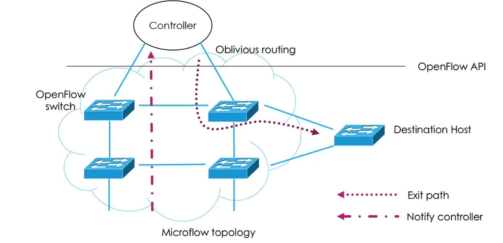
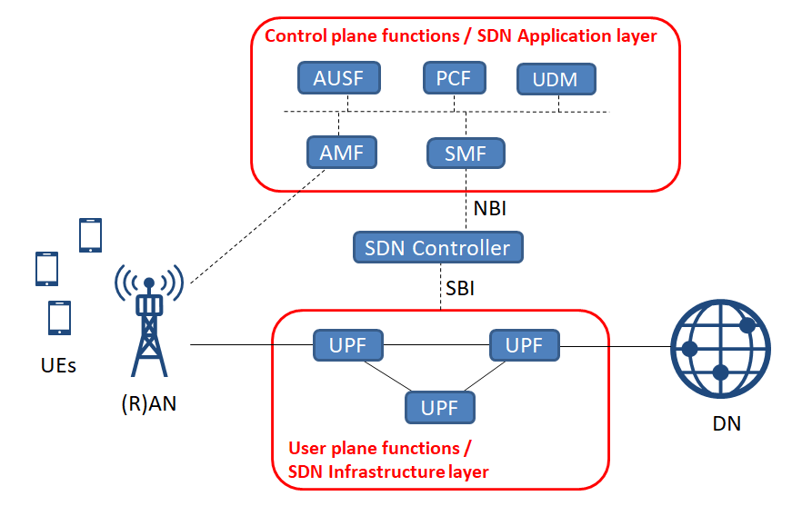

# 🧩 Software-Defined Networking (SDN) — Group Presentation  
**Course:** Mobile Computing (Frankfurt UAS)  
**Duration:** ~40–45 minutes  
**Group Members:**  
1. Dharni – Introduction & Motivation  
2. Vemula – SDN Architecture  
3. Wubishet – SDN Concepts  
4. Ashiqur Rahman – Technologies & Protocols  
5. Bhavani – How SDN Works  
6. Suva Sarkar – SDN in Mobile Computing (5G, IoT)

---

## 1️⃣ Dharni – Introduction & Motivation

### Slide 1 – Title  
**Software-Defined Networking (SDN)**  
- Separates control and data planes in network architecture  
- Enables centralized, software-driven network control

---

### Slide 2 – Traditional Networking Limitations  
- Static configuration and tightly coupled planes  
- Manual CLI-driven device management  
- Vendor lock-in and poor scalability  
- Limited responsiveness to dynamic workloads

---

### Slide 3 – The Need for SDN  
- Cloud-native, IoT, and 5G applications require agility  
- Centralized policy enforcement  
- Real-time traffic optimization  
- SDN solves modern networking bottlenecks with software

---

### Slide 4 – Objectives of SDN  
- Logical centralization of control  
- Network programmability through APIs  
- Vendor-agnostic interoperability  
- Simplified management and automation

---

### Slide 5 – Agenda Overview  
- 1️⃣ Introduction (Dharni)  
- 2️⃣ Architecture (Vemula)  
- 3️⃣ Concepts (Wubishet)  
- 4️⃣ Technologies (Ashiqur Rahman)  
- 5️⃣ How SDN Works (Bhavani)  
- 6️⃣ SDN in Mobile Computing (Suva Sarkar)  
- 🔚 Conclusion & Discussion

---

## 2️⃣ Vemula – SDN Architecture

### Slide 1 – SDN Architecture Layers  
- **Application Layer:** high-level policies & network services  
- **Control Layer:** centralized controller logic  
- **Infrastructure Layer:** programmable forwarding elements


---

### Slide 2 – Traditional vs SDN Models  
| Traditional Networking | SDN Architecture |
|------------------------|------------------|
| Distributed control logic | Centralized controller |
| Proprietary device configs | Open APIs (REST, OpenFlow) |
| Static behavior | Dynamic policy adaptation |

---

### Slide 3 – SDN Interfaces  
- **Northbound APIs:** Apps ↔ Controller (e.g., REST, Intent-based)  
- **Southbound APIs:** Controller ↔ Switches (e.g., OpenFlow, NETCONF)

---

### Slide 4 – Example Stack  
- Monitoring app (Application Layer)  
- ONOS controller (Control Layer)  
- Open vSwitch (Infrastructure Layer)

🗣 *Note:* “Northbound APIs define *what* to do, southbound APIs define *how*.”

---

## 3️⃣ Wubishet – SDN Concepts

### Slide 1 – Core SDN Concepts  
- **Control/Data Plane Decoupling**  
- **Global View of Network State**  
- **Centralized Intelligence**  
- **Programmability & Policy Abstraction**

---

### Slide 2 – Centralized Control  
- Controller acts as brain of the network  
- Knows topology, link states, traffic patterns  
- Optimizes path selection, bandwidth allocation

---

### Slide 3 – Network Programmability  
- Open APIs expose control to external applications  
- Use cases: dynamic ACLs, QoS, L4-L7 service chaining  
- DevOps-friendly: deploy network behavior like code

---

### Slide 4 – Policy-Based Adaptation  
- Network responds to intent (e.g., low-latency for video)  
- Example: load balance HTTP traffic dynamically  
- Enables automation and context-aware configuration

---

### Slide 5 – Abstraction with SDN  
- Simplifies hardware interaction  
- Vendors abstracted by protocol interface  
- Application developers don't need CLI/device-level logic

---

## 4️⃣ Ashiqur Rahman – Technologies & Protocols

### Slide 1 – OpenFlow Overview  
- Core SDN protocol (Southbound)  
- Flow table = match (e.g. src IP, dst port) + action (e.g., forward, drop)  
- Controller modifies flow entries dynamically


---

### Slide 2 – OpenFlow Example  
```text
match: ip_dst=10.0.0.2, tcp_dst=80  
action: output=2  
priority: 100  
```

---

### Slide 3 – Key Controllers  
- **ONOS** – Distributed, telco-grade controller  
- **OpenDaylight** – Modular, plugin-based platform  
- **Ryu** – Pythonic, scriptable, great for demos/prototyping

---

### Slide 4 – Emulation Tools  
- **Mininet**: simulate full network topologies on one host  
- Link with Ryu to see controller-switch interaction live  
- Example lab: emulate 3-switch network with web traffic routing

---

### Slide 5 – Additional Protocols  
- **NETCONF/YANG** – Configuration-focused  
- **RESTCONF/gRPC** – Modern streaming telemetry & config  
- **P4/P4Runtime** – Program the data plane pipeline directly

---

## 5️⃣ Bhavani – How SDN Works

### Slide 1 – Reactive Packet Handling  
1. Packet arrives at switch  
2. No match → sends Packet-In to controller  
3. Controller computes rule (flow path)  
4. Sends Flow-Mod to switch  
5. Rule installed, rest of flow forwarded at line-rate



---

### Slide 2 – OpenFlow Packet Lifecycle  
- **Packet-In**: request from switch  
- **Flow-Mod**: rule installed  
- **Packet-Out**: controller sends original packet

---

### Slide 3 – Benefits of SDN Packet Flow  
- Real-time load balancing  
- Quick fault recovery  
- Path diversity & application-aware routing

---

### Slide 4 – Sample Scenario  
> A new TCP connection starts → switch asks controller  
> Controller identifies optimal path → installs rules across switches  
> Flow is forwarded without further controller involvement

---

## 6️⃣ Suva Sarkar – SDN in 5G, IoT & Mobile Networking

### Slide 1 – SDN in 5G Architecture  
- Control/User Plane Separation (CUPS) in 5G mirrors SDN  
- SMF = control logic; UPF = data forwarding  
- Traffic steering logic managed by SDN controller



---

### Slide 2 – SDN + NFV  
- NFV virtualizes network functions (e.g., AMF, UPF, PGW)  
- SDN interconnects them dynamically and securely  
- Enables flexible service chaining and placement

---

### Slide 3 – Network Slicing with SDN  
- Isolates traffic per application/service (e.g., IoT vs URLLC)  
- SDN controller enforces slice policies (bandwidth, routing)  
- Supports real-time provisioning and lifecycle management

---

### Slide 4 – Use Case: Smart Factory  
- URLLC slice → low-latency path via SDN  
- Mobile broadband slice → best-effort routing  
- Controller dynamically adapts based on traffic

---

### Slide 5 – Challenges in 5G SDN  
- Scalability for millions of flows  
- Standardization across domains  
- Controller failover and security hardening

---

## 7️⃣ Group Conclusion (All)

### Slide 1 – Key Advantages  
- Faster provisioning  
- Automation & orchestration  
- Network visibility and optimization

---

### Slide 2 – Industry Examples  
- **Google B4 WAN:** SDN improved link utilization to 90–100%  
- **AT&T Domain 2.0:** SDN/NFV modernized telco core  
- **Facebook/Meta FBOSS:** controller-driven edge network

---

### Slide 3 – Challenges  
- Centralized controller = single point of failure  
- Debugging and visibility can be complex  
- Interoperability in hybrid SDN environments

---

### Slide 4 – Future Trends  
- Intent-based networking  
- AI/ML for adaptive control  
- P4 and programmable data planes  
- Edge-native SDN and 6G

---

### Slide 5 – Q&A Slide  
“Your Questions – Our Network Answers”

---

## 🕒 Time Allocation
| Presenter | Topic | Time |
|-----------|-------|------|
| Dharni | Introduction & Motivation | 5 min |
| Vemula | Architecture | 6 min |
| Wubishet | Concepts | 6 min |
| Ashiqur Rahman | Technologies & Protocols | 6 min |
| Bhavani | How SDN Works | 6 min |
| Suva Sarkar | SDN in Mobile/5G | 6 min |
| **Total** |  | **≈40–45 min** |

